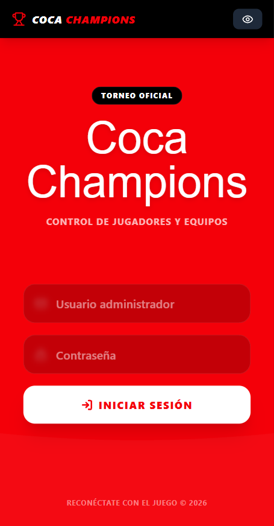
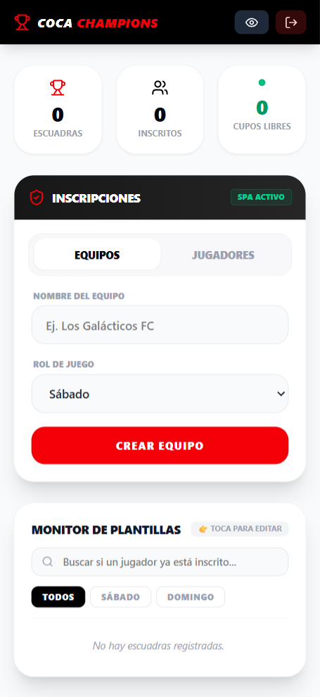
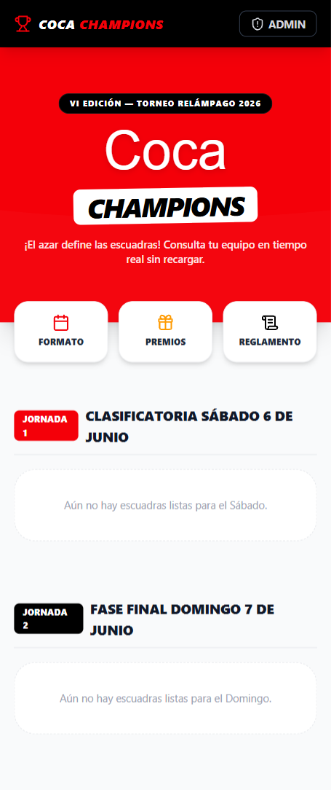

# 🏆 Coca-Cola Champions — Sistema de Gestión en Tiempo Real (Jornada Doble)


Plataforma web automatizada **Mobile-First** diseñada para la gestión, control, quiniela interactiva y consulta en tiempo real del torneo relámpago de fútbol de Coca-Cola. El sistema implementa una arquitectura moderna de software desacoplada en módulos, optimizada para soportar tráfico pesado de consultas y compartición fluida de datos mediante redes móviles (WhatsApp).

🚀 **Link del Proyecto en Vivo:** [coca-champions.vercel.app](https://coca-champions.vercel.app)

---

## 📸 Vista Previa del Sistema

<div align="center">
  
  
  
</div>

---

## 💡 Desafío de Negocio y Lógica del Torneo

El torneo corporativo opera bajo un formato dinámico de **Doble Jornada (Sábado y Domingo)** con un sistema estricto de cupos y clasificaciones paralelas:
1. **Cupos Limitados de Escuadra:** Los equipos se conforman de manera equitativa por sorteo, limitados de forma automática a un máximo estricto de **6 integrantes por escuadra** mediante validaciones lógicas en el servidor.
2. **Revancha de Doble Oportunidad:** Los jugadores eliminados en la jornada del Sábado tienen permitido reincorporarse a nuevos equipos creados para el Domingo. El sistema maneja historiales concurrentes y estados dinámicos sin corromper las bases de datos de la clasificatoria previa.
3. **Fase de Grupos y Roles de Juego:** Distribución automática en Grupo A y Grupo B, controlando el fixture en 3 vueltas independientes (1RA, 2DA y 3RA VUELTA) con actualización reactiva en vivo.

---

## 🏗️ Arquitectura del Proyecto y Modularización

Para garantizar que el software sea robusto, escalable y mantenible por cualquier desarrollador, el frontend está desacoplado por completo de la persistencia de datos mediante una **arquitectura por capas orientada a módulos**:

```text
coca-champions/
├── src/
│   ├── types/          # Contratos e interfaces estrictas de TypeScript (Moldes de Datos)
│   ├── services/       # Capa de Abstracción de Datos (Aislación de consultas e incrementos Firebase)
│   ├── components/     # Componentes encapsulados y reutilizables de la interfaz
│   │   └── admin/      # Bloques atómicos de la Mesa de Control (Stats, Forms, Grid, Modals, Fixture)
│   ├── pages/          # Páginas principales unificadas y reactivas (AdminPanel, PublicView)
│   ├── firebase.ts     # Inicialización segura de módulos de Google Cloud Firestore
│   ├── index.css       # Configuración de Tailwind CSS v4, fuentes corporativas y animaciones de ola
│   └── main.tsx        # Punto de entrada de la SPA de React
├── package.json        # Dependencias y scripts de construcción del ecosistema
└── vite.config.ts      # Configuración de compilación ultra-rápida de Vite